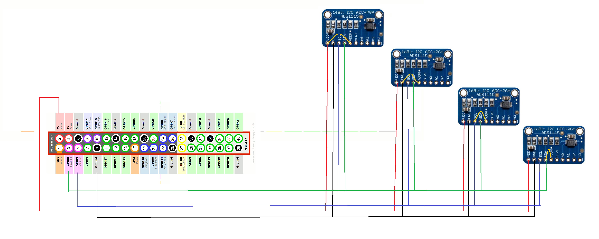

# PUBLISHER: Raspberry Pi Client for Sending Sensor Data

## Introduction
Raspbian client that reads and sends data acquired by four [Adafruit ADS1115](https://learn.adafruit.com/adafruit-4-channel-adc-breakouts/overview) units connected to a Rapsberry Pi at different sample rates over MQTT to a broker. This is the publishing side of the [Data Acquisition Platform](https://github.com/encresearch/data-assimilation-system).

## Hardware Setup

### Powering the ADCs
Each ADC unit can be powered with either 5v or 3.3v. Bare in mind that the maximum input voltage in each of the ADCs' units is VDD.

### I2C Connection
The Adafruit ADS1115 uses the I2C bus to communicate. This protocol needs just two pins to connect **SCL** and **SDA**. These can be shared by several I2C devices as long as the addresses are different. You need to enable the I2C interface in the Raspberry Pi. For this, open the terminal and type:
```$ sudo raspi-config```

This will open the ```Raspberry Pi Software Configuration Tool```. After this, go to ```Interfacing Options```, then ```P5 I2C```, and enter ```Yes``` to enable the ARM I2C interface.

The ADS11x5 chips have a base 7-bit I2C address of 0x48 (1001000) and allows four different addresses using the ADR pin. To program the address, connect the address pin as follows:
* 0x48 (1001000) ADR -> GND
* 0x49 (1001001) ADR -> VDD
* 0x4A (1001010) ADR -> SDA
* 0x4B (1001011) ADR -> SCL

For a complete setup of four ADS1115 units with different address, connect as below:


For more information about the Raspberry Pi GPIO, visit [here](https://www.raspberrypi.org/documentation/usage/gpio/).

## Dependencies and Setup
The dependencies can be met either by cloning into the project and setting up a conda environment based on the ```environment.yml``` file, or by building the publisher container alongside a telegraf container using the ```docker-compose.yml``` file.

### Install and run with Docker
> Telegraf not yet available

Install [Docker](https://docs.docker.com/install/)
```
$ sudo apt-get update
$ sudo apt-get upgrade 
$ curl -sSL https://get.docker.com | sh
``` 

Install [Docker-Compose](https://docs.docker.com/compose/install/)
```$ sudo pip install docker-compose```

Clone repository.
```$ git clone https://github.com/encresearch/publisher.git```

Run docker-compose
```$ sudo docker-compose -f docker-compose.yml up -d```

To stop and remove containers, networks and images created by up. (External volumes won't be removed)
```$ sudo docker-compose -f docker-compose.yml down```

### Install and Run with conda
Telegraf will have to be setup manually

Install Miniconda
```
$ sudo apt-get update && wget https://repo.continuum.io/miniconda/Miniconda3-latest-Linux-x86_64.sh
$ sudo md5sum Miniconda3-latest-Linux-armv7l.sh
$ sudo /bin/bash Miniconda3-latest-Linux-armv7l.sh
```

Change the default installation directory to ```/home/pi/miniconda3```

Edit the .bashrc file
```sudo nano /home/pi/.bashrc```

And add this at the end
```export PATH="/home/pi/miniconda3/bin:$PATH"```

Update conda package manager
```conda update conda```

Create a conda environment based off our YAML file
```conda env create -f environment.yml```

Activate the environment
```source activate mqtt-publisher```

To run, cd into ```mqtt_publisher/``` and execute the python file ```python publisher.py```.

## Contributing
Pull requests and stars are always welcome. To contribute, create a descriptive branch off of master (ex ```data-migration-tests```), commit to it, and submit a pull request.
